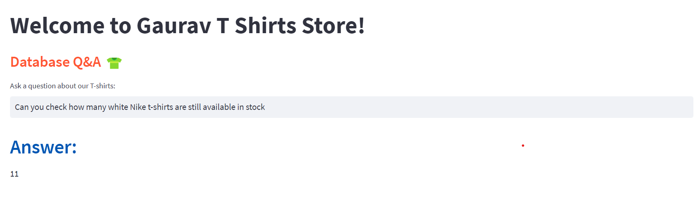

# SQL_Query_Master

We're developing an advanced system that interfaces with a MySQL database via Google Palm and Langchain. At SQL_Query_Master, a T-shirt retailer, our system enables natural language interaction with the database. Store managers can ask questions like:

- Can you check how many white Nike t-shirts are still available in stock?
- What's the projected revenue if we sell all extra-small t-shirts with discounts applied?

Our solution intelligently translates these queries into SQL commands and executes them on the MySQL database, providing accurate responses based on real-time data.

